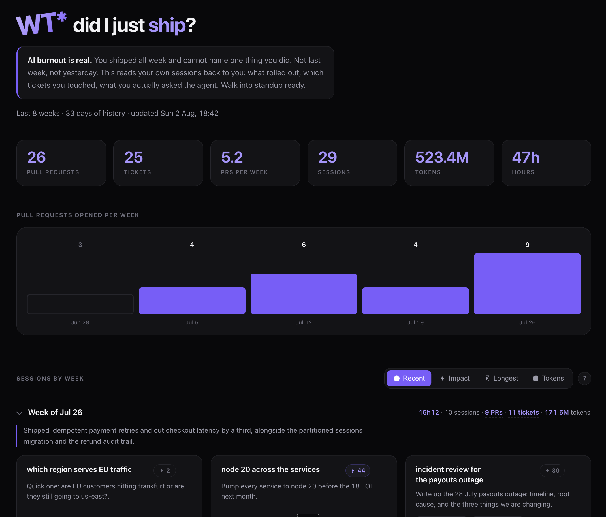
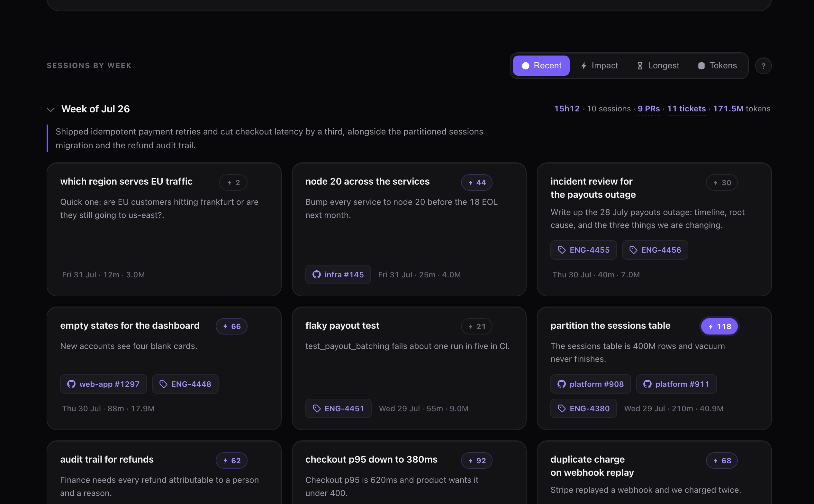
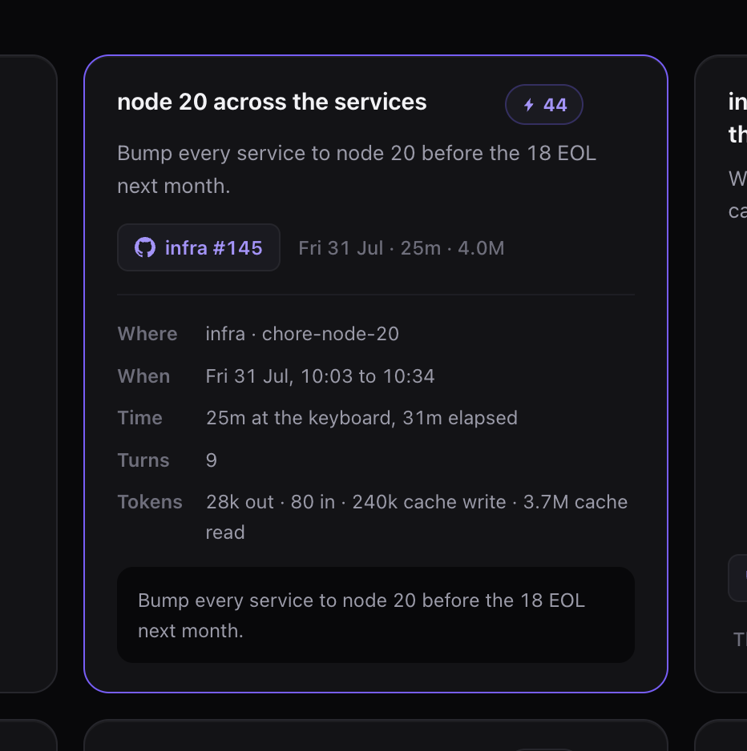

# standup

**WT\* did I just ship?**

You shipped all week and can't name one thing you did. Not last week, not yesterday.

`standup` reads the Claude Code sessions already sitting on your machine and turns them
into one page: what you shipped, which PRs and tickets came out of it, and what you
actually asked for. Open it before standup.

No API keys. No account. Nothing leaves your machine.



## Install

```
/plugin marketplace add OmriGM/standup
/plugin install standup
```

Then build your page from the history you already have:

```
/standup
```

That's it. From now on it updates itself every time a session ends.

<details>
<summary>Prefer a single file with no plugin?</summary>

One Python file, nothing to install alongside it.

```bash
mkdir -p ~/.claude/hooks
curl -o ~/.claude/hooks/standup.py \
  https://raw.githubusercontent.com/OmriGM/standup/main/hooks/standup.py
python3 ~/.claude/hooks/standup.py install
python3 ~/.claude/hooks/standup.py backfill
python3 ~/.claude/hooks/standup.py report
```

Pick one or the other. Doing both records every session twice.

</details>

## Updating

```
claude plugin marketplace update omrigm
claude plugin update standup@omrigm
```

Then restart Claude Code. Nothing updates on its own, and starting a new session is not
enough by itself.

The `@omrigm` suffix names the marketplace and is required. Plain
`claude plugin update standup` fails with `Plugin "standup" not found`.

## What you get

- **Your week, in one page.** Sessions grouped by week, newest first.
- **PRs and tickets** on every card, linked, with a chart of pull requests per week.
- **Real working time.** Long pauses aren't counted, so an overnight gap isn't billed as
  effort.
- **Hide** the sessions you don't care about, and bring them back later.
- **A one-line summary of each week**, if you want it. See below.

### Sorted by what you actually shipped

Not everything you did last week is worth mentioning. Every session gets an **impact
score**, and the sessions that shipped something rise to the top:

| | Points |
| --- | --- |
| Each pull request | 40 |
| Each ticket | 12 |
| Time at the keyboard | up to 20, maxing out at three hours |
| Back and forth | up to 8, maxing out at sixty turns |

**The caps are the whole idea.** Effort tops out at 28, which is less than a single pull
request, so a four hour session that produced nothing can never outrank one that opened a
PR. Hover any score and it shows you its own arithmetic, so the number is never something
you have to take on faith.

Hit **Impact** and the week reorders itself. **Longest** and **Tokens** are there too when
you want to know where the time or the spend went.



### Everything behind a session

Click any card and it opens: the repo and branch, how much of that session was actually at
the keyboard versus elapsed, how many turns it took, the token split, and the full thing
you originally asked for.



## Settings

Optional. Create `~/.claude/standup/config.json`:

```json
{
  "ticket_url": "https://linear.app/your-team/issue/{key}",
  "week_start": "monday",
  "ignore_prefixes": ["INC"],
  "embed_images": false,
  "model": "haiku"
}
```

| Setting | What it does |
| --- | --- |
| `ticket_url` | Makes ticket codes clickable. Put `{key}` where the ticket code goes. Works with Linear, Jira, GitHub Issues, anything with a predictable link. Leave it out and tickets show as plain text. |
| `week_start` | `monday` or `sunday`. If your week runs Sunday to Thursday, say so and the page regroups. |
| `ignore_prefixes` | Codes that look like tickets but aren't, in your world. Common ones like `CVE` are already ignored. |
| `embed_images` | Show screenshots you pasted into a prompt. Off by default, see Privacy. |
| `model` | Which model writes the weekly summaries. Defaults to `haiku`. |

## Weekly summaries

One sentence per week, plus a cleaner title and description on every card:

```bash
python3 ~/.claude/hooks/standup.py report --summaries
```

This is the only part that uses a model. It runs through the `claude` command you already
have, so there's no key to set up. Results are saved and only redone when a week gains
new sessions.

## Privacy

Short version: everything stays on your machine, and the page you generate contains your
whole history, so don't send the file to anyone.

- Recording never touches the network.
- Your session history, including the opening message of every session, is saved at
  `~/.claude/standup/sessions.jsonl`.
- **The page has all of that baked into it.** It's one self-contained file, not a viewer.
  Sending someone the page sends them everything. Share a screenshot instead.
- `--summaries` is the one thing that leaves your machine. It sends session titles and the
  first couple of lines of each prompt to a model. You have to ask for it, and it never
  runs on its own.

## Releasing

For anyone working on standup itself. There is one manual step:

1. Bump `version` in `.claude-plugin/plugin.json`.
2. Commit and push to `main`.

That's the whole process. CI runs the checks, then tags the commit and publishes a GitHub
Release on its own. Don't create releases by hand.

Installs are cached per version, so a change pushed without a bump reaches nobody. CI
fails the build if you forget. See [CLAUDE.md](CLAUDE.md) for the rest.

## Requirements

Python 3.9+ and Claude Code. No packages to install. Desktop notifications are macOS only
and are skipped everywhere else.

## Credits

Some icons are [Octicons](https://primer.style/octicons) (MIT).

## License

MIT
